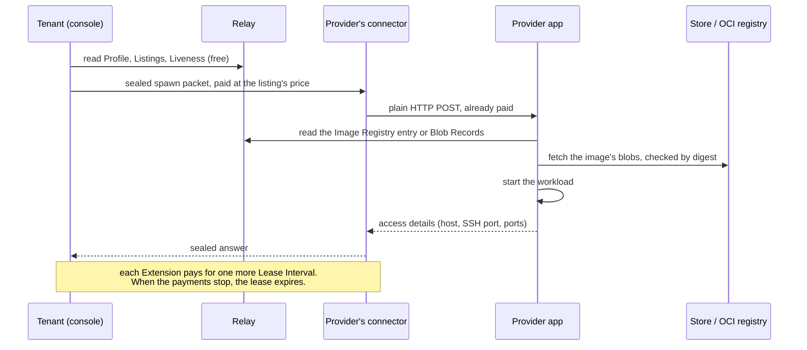

# TOON Network

A decentralized compute marketplace built on TOON. **Providers** sell leases on
workloads, **tenants** buy them over TOON payment channels, the TOON relay
carries discovery, and the TOON store holds image bytes.

This repository is the protocol: the [spec](docs/spec/toon-network-v1.md), the
[glossary](CONTEXT.md) and the [decisions](docs/adr/). The code lives in the
repositories [below](#the-stack).

## TL;DR

TOON is paid HTTP. An ordinary HTTP app sits behind a **connector**, which
collects a flat price per route over an ILP payment channel and hands the app a
request that is already paid for. Every write is a paid packet. Reads are free:
a relay serves plain Nostr over `wss://`, and asking a connector what it sells
costs nothing.

The roles:

- A **[Provider](CONTEXT.md#parties)** runs workloads on hardware it controls
  and publishes a Provider Profile, its Listings and its Liveness to its Relay
  Set. Together those are the [Provider Directory](CONTEXT.md#directory).
- A **[Tenant](CONTEXT.md#parties)** is whoever holds a lease's Continuation
  Token. It has no published identity and signs nothing. People act as tenants
  through the **[Console](CONTEXT.md#console)**.
- A **[Workload Gateway](CONTEXT.md#leasing)** fronts a workload at a stable
  hostname and follows it to whichever provider is running it. It is optional.
- A **relay** is a Nostr relay you pay to write to. It carries the Provider
  Directory and the [Image Registry](CONTEXT.md#registries).
- A **store** puts bytes on Arweave for a fee. Image blobs live there as Blob
  Records and their parts.
- A **gas station** pays the on-chain gas for a payer that holds none.
- A **connector** terminates payment in front of each of these. Connectors peer
  with each other, so a payer with one channel to a **hub** reaches every route
  behind it. A packet reaches its app directly or through any number of hops.

A spawn, which starts a lease and buys its first Lease Interval
([spec §6.2](docs/spec/toon-network-v1.md#62-spawn)):



Everything runs on a **devnet** today, with mock USDC. See [Networks](#networks).

## The stack

Every repository below is public under [toon-protocol](https://github.com/toon-protocol).

| Repository | What it is | Who runs it | Published |
|---|---|---|---|
| [connector](https://github.com/toon-protocol/connector) | The paid reverse proxy every TOON app sits behind: it collects the price, settles it on chain and forwards plain HTTP | Everyone who runs a TOON app | Image `ghcr.io/toon-protocol/connector` |
| [relay](https://github.com/toon-protocol/relay) | A Nostr relay with paid writes and free NIP-01 reads | Relay operators | Image `ghcr.io/toon-protocol/relay`, npm `@toon-protocol/relay` |
| [store](https://github.com/toon-protocol/store) | Paid Arweave blob storage (NIP-90 `kind:5094`) | Store operators | Image `ghcr.io/toon-protocol/store` |
| [gas-station](https://github.com/toon-protocol/gas-station) | Pays Solana fees and relays EVM meta-transactions for a payer with no gas | Gas station operators | Image `ghcr.io/toon-protocol/gas-station` |
| [provider](https://github.com/toon-protocol/provider) | The provider app (a hard fork of Paygress), its directory publisher, and the bundle that deploys them | Providers | Nothing yet. The deploy bundle builds the images on the box |
| [gateway](https://github.com/toon-protocol/gateway) | The Workload Gateway | Gateway operators (optional) | Nothing yet. The deploy bundle builds the image on the box |
| [console](https://github.com/toon-protocol/console) | The local app an Account uses to find providers, fund its payment channels and manage its workloads | Tenants, on their own machine | Nothing yet. Run it from a checkout |
| [toon-client](https://github.com/toon-protocol/toon-client) | The payer side: seals a request, pays it over a channel and returns the answer, from Node.js or the `toon` CLI | Anyone paying a route, and the console | npm `@toon-protocol/client` |
| [infra](https://github.com/toon-protocol/infra) | The local sandbox (the whole network in one `docker compose`) and the public devnet's docs | Developers | Nothing. It is run from a checkout |

## I want to…

| …to | Go to |
|---|---|
| Use the network: find a provider, fund a channel, spawn a workload | [console](https://github.com/toon-protocol/console) |
| Run a provider | [Run a provider](https://github.com/toon-protocol/provider#run-a-provider) |
| Run a Workload Gateway | [Run a gateway](https://github.com/toon-protocol/gateway#run-a-gateway). A provider does not need one |
| See what my node earned, and redeem it | The connector's [dashboard](https://github.com/toon-protocol/connector#the-dashboard) at `/dashboard` on its edge, and its [operator surface](https://github.com/toon-protocol/connector#the-operator-surface) (`POST /channels/:id/redeem-latest`) |
| Run the whole network on my machine | [infra `sandbox/`](https://github.com/toon-protocol/infra/blob/main/sandbox/README.md): `make setup && make up && make smoke` |
| See what is live on the devnet | [infra `docs/devnet.md`](https://github.com/toon-protocol/infra/blob/main/docs/devnet.md), or `node sandbox/scripts/devnet-status.mjs` in a clone of infra. Every check it makes is free |
| Pay a TOON route from code | [toon-client](https://github.com/toon-protocol/toon-client) |
| Put my own app behind a connector | [connector](https://github.com/toon-protocol/connector), then the sandbox's [Build your own TOON app](https://github.com/toon-protocol/infra/blob/main/sandbox/README.md#5-build-your-own-toon-app) |
| Implement a tenant client or another provider | The [spec](docs/spec/toon-network-v1.md) and the [wire fixtures](docs/spec/fixtures/README.md), which `node docs/spec/fixtures/check.mjs` checks with no dependencies |

## Networks

**Devnet is the only network.** Nothing runs on mainnet yet.

The devnet settles on **Base Sepolia** and **Solana devnet**, in a mock USDC
that anybody can draw from the faucet. Nothing earned or spent on it is real
money. The faucet gives no native gas: devnet SOL and Base Sepolia ETH come from
elsewhere ([devnet.md](https://github.com/toon-protocol/infra/blob/main/docs/devnet.md#money-and-the-one-thing-no-faucet-gives-you)
says where).

| Service | ILP address | Endpoint |
|---|---|---|
| Faucet (mock USDC) | | `https://faucet.devnet.toonprotocol.dev` |
| Relay | `g.toon.relay` | `https://proxy.relay.devnet.toonprotocol.dev` (paid writes), `wss://relay-ws.devnet.toonprotocol.dev` (free reads) |
| Store | `g.toon.store` | `https://proxy.ario.devnet.toonprotocol.dev` |
| Gas station | `g.toon.gas` | `https://proxy.gas.devnet.toonprotocol.dev` |
| Provider | `g.toon.provider` | `https://proxy.provider.devnet.toonprotocol.dev` |
| Workload Gateway | `g.toon.workload-gateway` | `https://proxy.gateway.devnet.toonprotocol.dev`, serving `<label>.gw.devnet.toonprotocol.dev` |

Ask any of them what it sells, for free:

```bash
npx @toon-protocol/client describe https://proxy.provider.devnet.toonprotocol.dev
```

## Reference

- **Spec:** [`docs/spec/toon-network-v1.md`](docs/spec/toon-network-v1.md), a
  draft. It covers what a provider must publish, accept and do, and the
  Workload Gateway and relay write edge besides.
- **Glossary:** [`CONTEXT.md`](CONTEXT.md). Its terms are normative, in the
  spec and in the code.
- **Decisions:** [`docs/adr/`](docs/adr/). Where the spec and an ADR disagree,
  the ADR wins.
- **Wire fixtures:** [`docs/spec/fixtures/`](docs/spec/fixtures/), golden
  files generated by the provider's wire tests.
- **Issues:** [GitHub Issues](https://github.com/toon-protocol/TOON_Network/issues)
  on this repository hold the specs and the tickets that span the stack. See
  [`docs/agents/issue-tracker.md`](docs/agents/issue-tracker.md) for the
  conventions.
